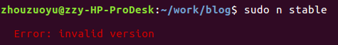

**hexo s**一直有问题，报错：

根据提示使用**npm install hexo \-\-save**不能解决问题。
后面尝试更新node.js来解决问题。
<!--more-->
## 更新node.js
1. 
参考这篇[Ubuntu16.04安装最新版nodejs（2018）](https://blog.csdn.net/well2049/article/details/79138045)，最后报错：

2. 
按照[nodejs版本快速升至最新版](https://blog.csdn.net/baidu_22183129/article/details/78492215)，直接进行替换。

更新完后hexo能正常使用了。
