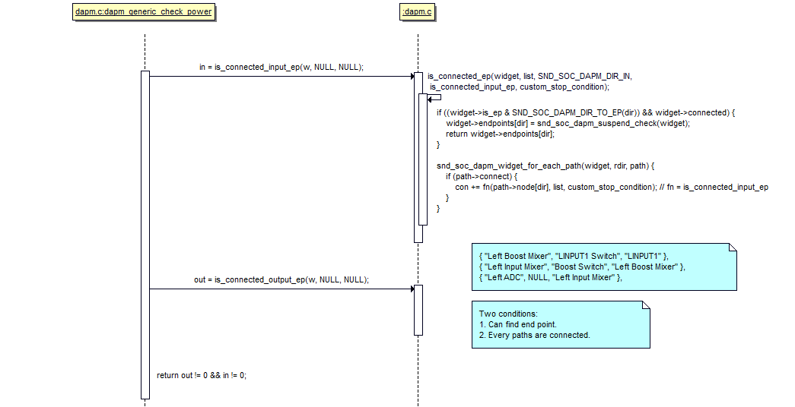

# 导言
搜寻指定widget是否在complete path上
1. 该widget往前遍历(path->connect)能找到input_ep
2. 该widget往后遍历能找到output_ep

# 分析
设置card->power_state
```c
snd_soc_suspend
	snd_power_change_state(card->snd_card, SNDRV_CTL_POWER_D3hot);
		card->power_state = state;
```
<!--more-->
## power check流程

## is_connected_input_ep
|  input_ep |
|  ----  |
| snd_soc_dapm_mic |
| snd_soc_dapm_input |
| snd_soc_dapm_vmid |
| snd_soc_dapm_siggen |

```c
static int is_connected_input_ep(struct snd_soc_dapm_widget *widget)
{
	// snd_soc_dapm_dac||snd_soc_dapm_aif_in
	switch (widget->id) {
	case snd_soc_dapm_dac:
	case snd_soc_dapm_aif_in:
		if (widget->active)
			// 声卡正常工作的情况下return 1，所以说snd_soc_dapm_dac||snd_soc_dapm_aif_in也是一类input_ep
			return snd_soc_dapm_suspend_check(widget);
	}
	// 如果是snd_soc_dapm_input||snd_soc_dapm_vmid||snd_soc_dapm_mic||snd_soc_dapm_line且没有suspend，则return 1
	if (widget->connected) {
		/* connected pin ? */
		if (widget->id == snd_soc_dapm_input && !widget->ext)
			// 没有suspend则return 1
			// SNDRV_CTL_POWER_D3已经是off了
			return snd_soc_dapm_suspend_check(widget);
				level = snd_power_get_state(widget->dapm->card->snd_card);
					return card->power_state;
				default:
					return 1;
	}

	// 递归往前搜寻
	// widget找到path，最终到达path->source
	list_for_each_entry(path, &widget->sources, list_sink) {
		if (path->walked)
			continue;

		if (path->source && path->connect) {
			path->walked = 1;
			con += is_connected_input_ep(path->source);
		}
	}
}
```

## is_connected_output_ep
|  output_ep |
|  ----  |
| snd_soc_dapm_spk |
| snd_soc_dapm_hp |
| snd_soc_dapm_output |
| snd_soc_dapm_sink |

```c
static int is_connected_output_ep(struct snd_soc_dapm_widget *widget)
{
	// snd_soc_dapm_adc||snd_soc_dapm_aif_out
	switch (widget->id) {
	case snd_soc_dapm_adc:
	case snd_soc_dapm_aif_out:
		if (widget->active)
			return snd_soc_dapm_suspend_check(widget);
				// 声卡正常工作的情况下return 1，所以说snd_soc_dapm_adc||snd_soc_dapm_aif_out也是一类output_ep
				int level = snd_power_get_state(widget->dapm->card->snd_card);
				switch (level) {
				case SNDRV_CTL_POWER_D3hot:
				case SNDRV_CTL_POWER_D3cold:
					return widget->ignore_suspend;
				default:
					return 1;
	}
	
	// snd_soc_dapm_output||snd_soc_dapm_hp||snd_soc_dapm_spk||snd_soc_dapm_line
	if (widget->connected) {
		/* connected pin ? */
		if (widget->id == snd_soc_dapm_output && !widget->ext)
			return snd_soc_dapm_suspend_check(widget);

		/* connected jack or spk ? */
		if (widget->id == snd_soc_dapm_hp || widget->id == snd_soc_dapm_spk ||
		    (widget->id == snd_soc_dapm_line && !list_empty(&widget->sources)))
			return snd_soc_dapm_suspend_check(widget);
	}
	
	// 往后递归找到output_ep
	list_for_each_entry(path, &widget->sinks, list_source) {
		if (path->walked)
			continue;

		if (path->sink && path->connect) {
			path->walked = 1;
			con += is_connected_output_ep(path->sink);
		}
	}
}
```
