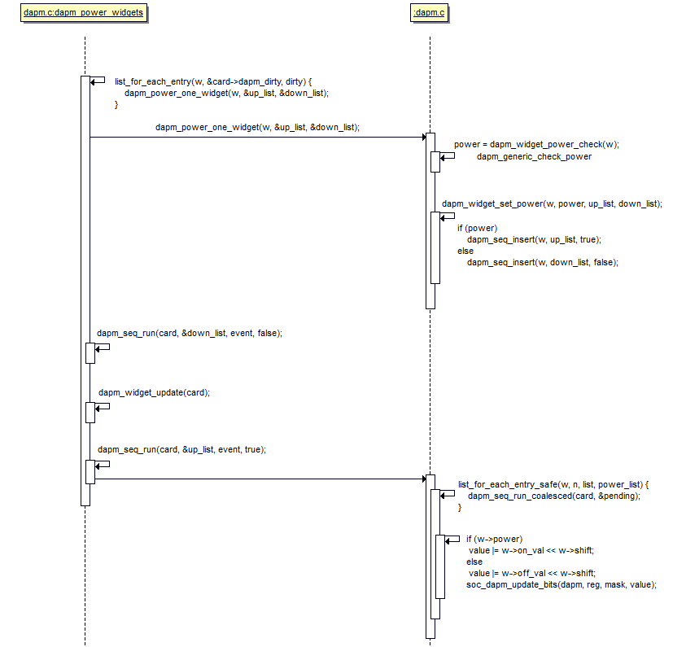

# soc_pcm_prepare
操作pcm设备时会调用soc_pcm_prepare
```c
static int soc_new_pcm(struct snd_soc_pcm_runtime *rtd, int num)
	soc_pcm_ops->prepare	= soc_pcm_prepare;
```
<!--more-->
## snd_soc_dapm_stream_event
```c
static int soc_pcm_prepare(struct snd_pcm_substream *substream)
	if (substream->stream == SNDRV_PCM_STREAM_PLAYBACK)
		snd_soc_dapm_stream_event(rtd,
					  codec_dai->driver->playback.stream_name,
					  SND_SOC_DAPM_STREAM_START);
	else
		snd_soc_dapm_stream_event(rtd,
					  codec_dai->driver->capture.stream_name,
					  SND_SOC_DAPM_STREAM_START);
```

# dapm_power_widgets
对所有的widget都执行power_check，通过上电，不通过下电
需要上电的放到up_list，需要下电的放到down_list，然后操作相应的reg

```c
int snd_soc_dapm_stream_event(struct snd_soc_pcm_runtime *rtd,
	const char *stream, int event)
	soc_dapm_stream_event(&codec->dapm, stream, event);
		dapm_power_widgets(dapm, event);
			// 对声卡上所有的widget都执行power_check，如果在complete path上则放到up_list上
			list_for_each_entry(w, &card->widgets, list) {
				if (!w->force)
					power = w->power_check(w);	// 执行power_check
				// 放到up_list上
				if (power)
					dapm_seq_insert(w, &up_list, true);
				else
					dapm_seq_insert(w, &down_list, false);
				
				// 对up_list上的widget上电
				dapm_seq_run(dapm, &up_list, event, true);
					list_for_each_entry_safe(w, n, list, power_list) {	// 利用list的地址得到widget地址
						if (!list_empty(&pending))
							dapm_seq_run_coalesced(cur_dapm, &pending);
								reg = list_first_entry(pending, struct snd_soc_dapm_widget,
										       power_list)->reg;
								if (w->power)
									value |= w->on_val << w->shift;	// widget定义中会设置on_val
								else
									value |= w->off_val << w->shift;
								snd_soc_update_bits(dapm->codec, reg, mask, value);	// 操作reg
					}
			}
```
