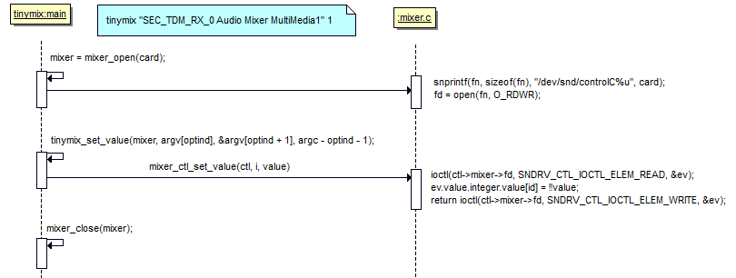
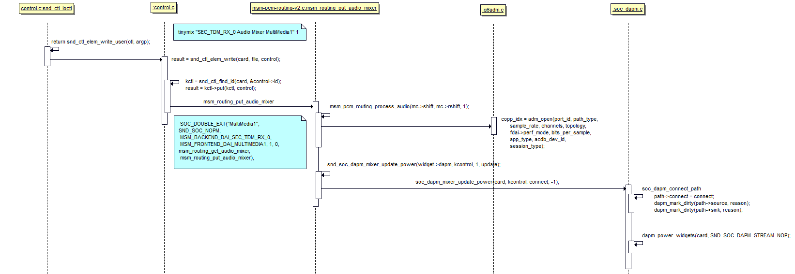

用户层操作，会调用对应底层kcontrol的put函数

# user space
tinymix "SEC_TDM_RX_0 Audio Mixer MultiMedia1" 1
操作/dev/snd/controlC%u节点，把值传递给底层
<!--more-->

```c
	/* 
	 * 1. 获取信息
	 * 把ctl的信息都拿回来保存到mixer->ctl中
	 */
	mixer = mixer_open(card);	// 0
		snprintf(fn, sizeof(fn), "/dev/snd/controlC%u", card);	// /dev/snd/controlC0
    	fd = open(fn, O_RDWR);
		/* 
		 * 第一次SNDRV_CTL_IOCTL_ELEM_LIST
		 * 为了知道有多少ctl，分配足够的空间
		 */
		ioctl(fd, SNDRV_CTL_IOCTL_ELEM_LIST, &elist);
		mixer->ctl = calloc(elist.count, sizeof(struct mixer_ctl));
		mixer->elem_info = calloc(elist.count, sizeof(struct snd_ctl_elem_info));
		mixer->count = elist.count;
		mixer->fd = fd;
		// 第二次SNDRV_CTL_IOCTL_ELEM_LIST
		ioctl(fd, SNDRV_CTL_IOCTL_ELEM_LIST, &elist);
		for (n = 0; n < mixer->count; n++) {
		    struct mixer_ctl *ctl = mixer->ctl + n;

		    ctl->mixer = mixer;
		    ctl->info = mixer->elem_info + n;
		    ctl->info->id.numid = eid[n].numid;
		    strncpy((char *)ctl->info->id.name, (char *)eid[n].name,	// 保存名字
		            SNDRV_CTL_ELEM_ID_NAME_MAXLEN);
		    ctl->info->id.name[SNDRV_CTL_ELEM_ID_NAME_MAXLEN - 1] = 0;
		}

	// 2. 写值
	ret = tinymix_set_value(mixer, argv[optind], &argv[optind + 1], argc - optind - 1);	// argc=3, optind=1, "SEC_TDM_RX_0 Audio Mixer MultiMedia1" 1
		ctl = mixer_get_ctl_by_name(mixer, control);	// mixer, "SEC_TDM_RX_0 Audio Mixer MultiMedia1"
			for (n = 0; n < mixer->count; n++)
				if (!strcmp(name, (char*) mixer->elem_info[n].id.name))
				    return mixer_get_ctl(mixer, n);

	    type = mixer_ctl_get_type(ctl);	// MIXER_CTL_TYPE_BOOL
	    num_ctl_values = mixer_ctl_get_num_values(ctl);	// 2

		int value = atoi(values[0]);	// 1
        for (i = 0; i < num_ctl_values; i++) {
            mixer_ctl_set_value(ctl, i, value);
				// 回写
				ev.id.numid = ctl->info->id.numid;
				ret = ioctl(ctl->mixer->fd, SNDRV_CTL_IOCTL_ELEM_READ, &ev);
				ev.value.integer.value[id] = !!value;
				return ioctl(ctl->mixer->fd, SNDRV_CTL_IOCTL_ELEM_WRITE, &ev);
        }
```

# kernel space

1. 获取信息
```c
snd_ctl_ioctl
	case SNDRV_CTL_IOCTL_ELEM_LIST:
		return snd_ctl_elem_list(card, argp);
			copy_from_user(&list, _list, sizeof(list))
				list_for_each_entry(kctl, &card->controls, list) {	// 把card->controls中所有的snd_kcontrol都遍历一遍
					for (jidx = offset; jidx < kctl->count; jidx++) {
						snd_ctl_build_ioff(&id, kctl, jidx);
						if (copy_to_user(list.pids + list.used, &id,
								 sizeof(id))) {
							err = -EFAULT;
							goto out;
						}
						list.used++;
					}
				}
```

2. 写值
```c
// 其实就是调用snd_kcontrol->put
snd_ctl_ioctl
	case SNDRV_CTL_IOCTL_ELEM_WRITE:
		return snd_ctl_elem_write_user(ctl, argp);
			result = snd_ctl_elem_write(card, file, control);
				kctl = snd_ctl_find_id(card, &control->id);
					return snd_ctl_find_numid(card, id->numid);
						list_for_each_entry(kctl, &card->controls, list) {
							if (kctl->id.numid <= numid && kctl->id.numid + kctl->count > numid)
								return kctl;
						}
				result = kctl->put(kctl, control);	// msm_routing_put_audio_mixer
					if (ucontrol->value.integer.value[0] &&
					   msm_pcm_routing_route_is_set(mc->shift, mc->rshift) == false) {
						// 写1：enable
						msm_pcm_routing_process_audio(mc->shift, mc->rshift, 1);	// MSM_BACKEND_DAI_SEC_TDM_RX_0, MSM_FRONTEND_DAI_MULTIMEDIA1
					} else if (!ucontrol->value.integer.value[0] &&
						  msm_pcm_routing_route_is_set(mc->shift, mc->rshift) == true) {
						// 写0：disable
						msm_pcm_routing_process_audio(mc->shift, mc->rshift, 0);
					}
```
