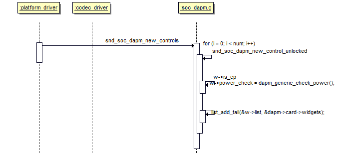
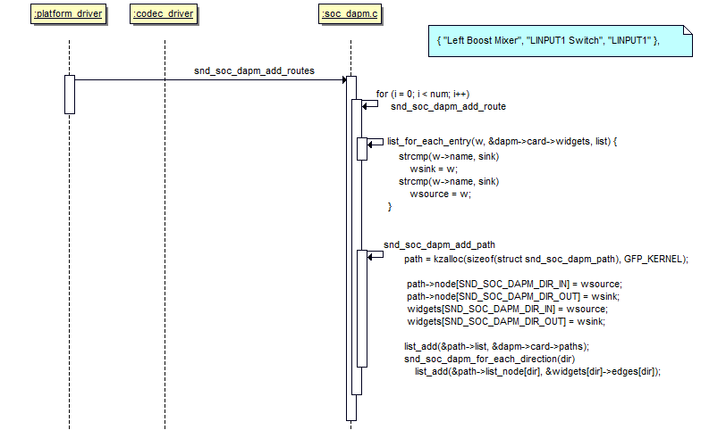

# 源码
> wm8960.c (linux-3.0.86\sound\soc\codecs)
> soc-dapm.c (linux-3.0.86\sound\soc\codecs)

# 注册widget和path
先注册widget再添加route
因为创建path需要widget的支撑
```c
static int wm8960_add_widgets(struct snd_soc_codec *codec)
	snd_soc_dapm_new_controls(dapm, wm8960_dapm_widgets,
				  ARRAY_SIZE(wm8960_dapm_widgets));
	snd_soc_dapm_add_routes(dapm, audio_paths, ARRAY_SIZE(audio_paths));
```
<!--more-->
# widget
## 定义
```c
static const struct snd_soc_dapm_widget wm8960_dapm_widgets[] = {
	SND_SOC_DAPM_INPUT("LINPUT1"),
	...
};
```
mixer类型的widget必然有switch
```c
static const struct snd_kcontrol_new wm8960_lin_boost[] = {
	SOC_DAPM_SINGLE("LINPUT2 Switch", WM8960_LINPATH, 6, 1, 0),
	SOC_DAPM_SINGLE("LINPUT3 Switch", WM8960_LINPATH, 7, 1, 0),
	SOC_DAPM_SINGLE("LINPUT1 Switch", WM8960_LINPATH, 8, 1, 0),	// WM8960_LINPATH reg的第8位决定开关的状态
};
SND_SOC_DAPM_MIXER("Left Boost Mixer", WM8960_POWER1, 5, 0,
		   wm8960_lin_boost, ARRAY_SIZE(wm8960_lin_boost)),
```

## 注册
只是添加到dapm->card->widgets中，创建声卡的时候会遍历它进行相应的处理

```c
snd_soc_dapm_new_controls(dapm, wm8960_dapm_widgets, ARRAY_SIZE(wm8960_dapm_widgets));
	for (i = 0; i < num; i++) {
		ret = snd_soc_dapm_new_control(dapm, widget);
			w = dapm_cnew_widget(widget);
			list_add(&w->list, &dapm->card->widgets);	// 添加到链表中
			w->connected = 1;
		widget++;
	}
```

## process
主要是创建里面的kcontrol
```c
snd_soc_dapm_new_widgets
	list_for_each_entry(w, &card->widgets, list)
	{
		if (w->num_kcontrols) {
			w->kcontrols = kzalloc(w->num_kcontrols *
						sizeof(struct snd_kcontrol *),
						GFP_KERNEL);
		}

		switch(w->id) {
		case snd_soc_dapm_switch:
		case snd_soc_dapm_mixer:
		case snd_soc_dapm_mixer_named_ctl:
			dapm_new_mixer(w);	// 主要是创建里面的kcontrol
				for (i = 0; i < w->num_kcontrols; i++) {
					ret = dapm_create_or_share_kcontrol(w, i);
						snd_soc_cnew(&w->kcontrol_news[kci], NULL, name, prefix);
						ret = snd_ctl_add(card, kcontrol);
				}

			break;
		case snd_soc_dapm_mux:
		case snd_soc_dapm_demux:
			dapm_new_mux(w);
			break;
		case snd_soc_dapm_pga:
		case snd_soc_dapm_out_drv:
			dapm_new_pga(w);
			break;
		case snd_soc_dapm_dai_link:
			dapm_new_dai_link(w);
			break;
		default:
			break;
		}

		dapm_mark_dirty(w, "new widget");
	}
	dapm_power_widgets(card, SND_SOC_DAPM_STREAM_NOP);
```

# route
## 定义
声明使用哪些widget组成route
> sink <- control <- source

```c
static const struct snd_soc_dapm_route audio_paths[] = {
	{ "Left Boost Mixer", "LINPUT1 Switch", "LINPUT1" }
	...
};
```

## 注册
将创建path，path有3个链表
```c
struct snd_soc_dapm_path {
	struct list_head list_source;
	struct list_head list_sink;
	struct list_head list;
};
```
任何一个widget都可以找到对应的path，从而找到source/sink
```c
list_add(&path->list, &dapm->card->paths);
list_add(&path->list_sink, &wsink->sources);
list_add(&path->list_source, &wsource->sinks);
```

1. 根据route创建path
2. 设置path->connect
    2.1 NULL：直连
    2.2 其他需要读取reg来判断

```c
snd_soc_dapm_add_routes(dapm, audio_paths, ARRAY_SIZE(audio_paths));
	for (i = 0; i < num; i++) {
		ret = snd_soc_dapm_add_route(dapm, route);
			sink = route->sink;
			source = route->source;
			/* 
			 * 通过name在dapm->card->widgets链表中搜索，将结果保存到wsink和wsource中
			 * 因为route中定义的只是字符串而已，需要widget的支撑
			 */
			list_for_each_entry(w, &dapm->card->widgets, list) {
				if (!wsink && !(strcmp(w->name, sink))) {
					wtsink = w;
					if (w->dapm == dapm)
						wsink = w;
					continue;
				}
				if (!wsource && !(strcmp(w->name, source))) {
					wtsource = w;
					if (w->dapm == dapm)
						wsource = w;
				}
			}
			
			// 创建path
			path = kzalloc(sizeof(struct snd_soc_dapm_path), GFP_KERNEL);
			// 2. path中保存widget信息
			path->source = wsource;
			path->sink = wsink;
			path->connected = route->connected;
			
			// { "Left Input Mixer", NULL, "LINPUT1", }
			if (control == NULL) {	// NULL: 直连
				list_add(&path->list, &dapm->card->paths);
				// 1. widget中保存path信息
				list_add(&path->list_sink, &wsink->sources);
				list_add(&path->list_source, &wsource->sinks);
				path->connect = 1;
				return 0;
			}
			// 不是直连的情况，看wsink类型
			switch (wsink->id) {
			case snd_soc_dapm_adc:
			case snd_soc_dapm_dac:
			case snd_soc_dapm_pga:
			case snd_soc_dapm_out_drv:
			case snd_soc_dapm_input:
			case snd_soc_dapm_output:
			case snd_soc_dapm_micbias:
			case snd_soc_dapm_vmid:
			case snd_soc_dapm_pre:
			case snd_soc_dapm_post:
			case snd_soc_dapm_supply:
			case snd_soc_dapm_aif_in:
			case snd_soc_dapm_aif_out:
				list_add(&path->list, &dapm->card->paths);
				list_add(&path->list_sink, &wsink->sources);
				list_add(&path->list_source, &wsource->sinks);
				path->connect = 1;
				return 0;
			// mux
			case snd_soc_dapm_mux:
			case snd_soc_dapm_virt_mux:
			case snd_soc_dapm_value_mux:
				ret = dapm_connect_mux(dapm, wsource, wsink, path, control,
					&wsink->kcontrol_news[0]);
				break;
			// mixer
			case snd_soc_dapm_switch:
			case snd_soc_dapm_mixer:
			case snd_soc_dapm_mixer_named_ctl:
				ret = dapm_connect_mixer(dapm, wsource, wsink, path, control);	// control == "LINPUT1 Switch"
				break;
			case snd_soc_dapm_hp:
			case snd_soc_dapm_mic:
			case snd_soc_dapm_line:
			case snd_soc_dapm_spk:
				list_add(&path->list, &dapm->card->paths);
				list_add(&path->list_sink, &wsink->sources);
				list_add(&path->list_source, &wsource->sinks);
				path->connect = 0;
				return 0;
			}
			
		route++;
	}
```

读取寄存器进行判断这个path是否connect
```c
dapm_connect_mixer
	for (i = 0; i < dest->num_kcontrols; i++) {	// 3个kcontrol
		if (!strcmp(control_name, dest->kcontrol_news[i].name)) {
			list_add(&path->list, &dapm->card->paths);
			list_add(&path->list_sink, &dest->sources);
			list_add(&path->list_source, &src->sinks);
			path->name = dest->kcontrol_news[i].name;	// LINPUTX Switch
			
			// 通过读取指定寄存器来判断是否connect
			dapm_set_path_status(dest, path, i);
				struct soc_mixer_control *mc = (struct soc_mixer_control *)
					w->kcontrol_news[i].private_value;
				unsigned int reg = mc->reg;	// 例如WM8960_LINPATH
				val = snd_soc_read(w->codec, reg);
				val = (val >> shift) & mask;
				if ((invert && !val) || (!invert && val))
					p->connect = 1;
				else
					p->connect = 0;
			return 0;
		}
	}
```
