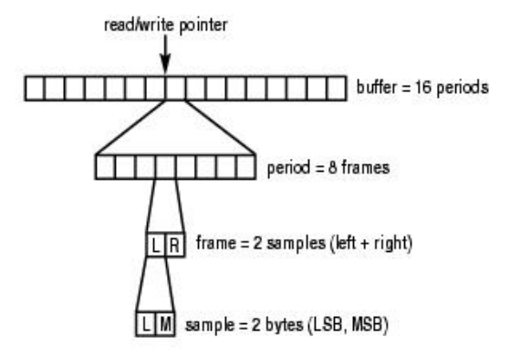

* Sample：样本长度，音频数据最基本的单位，常见的有8位和16位；
* Channel：声道数，分为单声道mono和立体声stereo；
* Frame：帧，构成一个完整的声音单元，Frame = Sample * channel；
* Rate：采样率，即每秒的采样次数，针对帧而言；
* Period size：周期，每次硬件中断处理音频数据的**帧数**，对于音频设备的数据读写，以此为单位；
* Buffer size：数据缓冲区大小，这里指runtime的buffer size；一般来说buffer_size = period_size * period_count，period_count相当于处理完一个 buffer数据所需的硬件中断次数。
