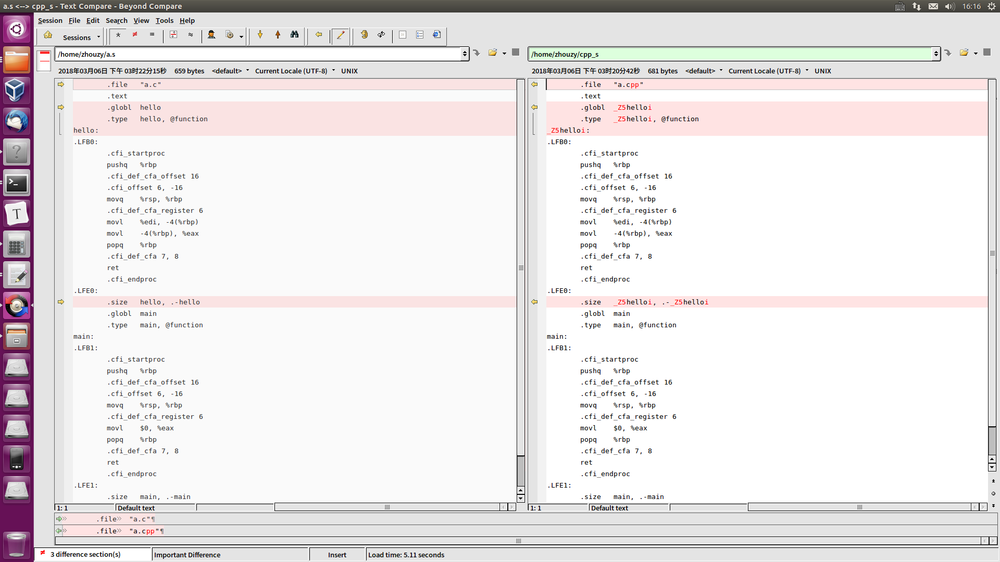

# 导言
extern "C"是为了**实现类C和C++的混合编程**
在C++源文件中的语句前面加上extern "C"，表明它按照类C的编译和连接规约来编译和连接，而不是C++的编译的连接规约。
<!--more-->
# 分析
一段简单的code，分别生成c和cpp文件
```c
int hello(int a)
{
	return a;
}

int main(void)
{
	return 0;
}
```

分别生成汇编文件
gcc -S a.c -o a.s
g++ -S a.cpp -o cpp_s

对比如下


可以从中看到cpp生成汇编文件中的符号会带**前缀_Z5**以及**后缀i**(代表参数int)，这样的做法是为了实现函数的重载
而c文件生成的汇编文件中的符号并没有前缀和后缀
如果在c++中不使用extern "c"进行修饰的话，因为不同的编译规则导致输出的符号并不相同，势必无法进行正确的链接。所以为了在c++中能使用c中代码，必须使用extern "c"来进行修饰。
