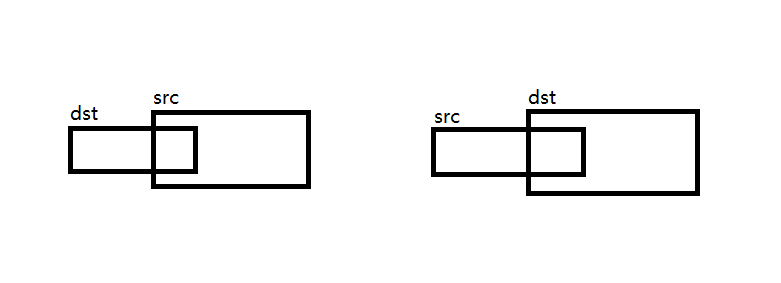

# memcpy
> 不需要考虑dst和src有重叠的情况

```c
static void *memcpy(void *dst, const void *src, size_t n)
{
	if (dst==NULL || src==NULL)
		return NULL;

	// 按字节cp，所以需要void * -> char *
	char *p1 = (char *)dst;
	char *p2 = (char *)src;

	while (n--)
		*(p1++) = *(p2++);

	// 返回，可以级联使用
	return dst;
}

```
<!--more-->
# memmove
> 需要考虑mem有重叠的情况



重叠有两种情况
1. dst部分地址被src踩到
	从小到大依字节cp，和memcpy一致
2. src部分地址被dst踩到
	从大到小依字节cp
```c
static void *memmove(void *dst, const void *src, size_t n)
{
	if (dst==NULL || src==NULL)
		return NULL;

	char *p1 = (char *)dst;
	char *p2 = (char *)src;
	
	if ((p1>p2) && ((p1-p2)<n)) {
		// 情况2
		while (n--)
			*(p1+n) = *(p2+n);	// 从大到小依字节cp
	} else {
		// 情况1
    	while (n--)
			*(p1++) = *(p2++);	// 从小到大依字节cp
	}
	
	return dst;
}
```
